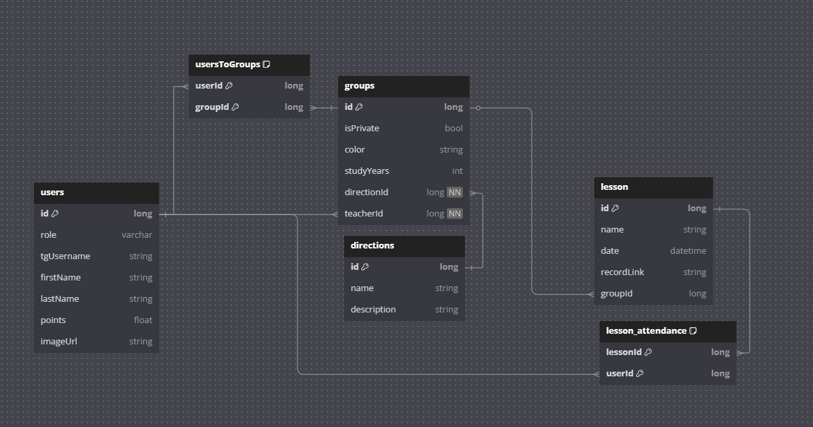

# Команда: "Бэкендеры"

## Участники команды:
- **Соболев Иван Андреевич**
- **Матигоров Никита Иванович**

## Список задач Ивана:
1. Система пользователя
2. Система аутентификации
3. Рефакторинг кода
4. Менеджер тасков

## Список задач Никиты:
1. Система уроков
2. Система групп
3. Система направлений
4. Докер

## Функционал системы:
1. CRUD группы
2. CRUD уроков
3. CRUD направлений
4. CRUD пользователей
5. Система аутентификации через Телеграм

## Дополнительные материалы:
- https://www.figma.com/design/jzpZ6dL9PKRezyZWqUeWwj/Untitled?node-id=1-6&t=AnCQLAlu3LcT69J9-0
- https://www.figma.com/board/zXlIYNSQNt979UrKLGR5wk/Untitled?node-id=0-1&p=f&t=qzWtdKpxKf0XonpN-0
- 
